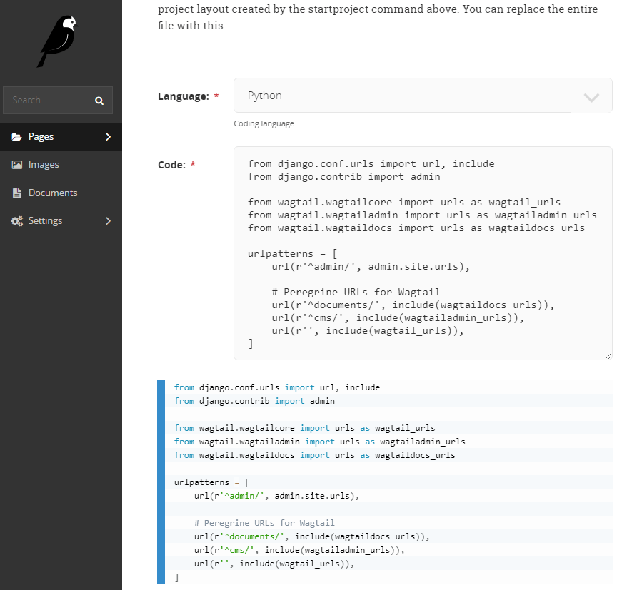

# Wagtail Code Block

Wagtail Code Block is a syntax highlighted block for source code for the Wagtail CMS. It features real-time highlighting in the Wagtail editor, the front end, line numbering, and support for PrismJS themes.

It uses the [PrismJS](http://prismjs.com/) library both in Wagtail Admin and the website and requires jQuery.

## Example Usage

```python
from wagtailcodeblock.blocks import CodeBlock

class ContentStreamBlock(StreamBlock):
    heading = TextBlock()
    paragraph = TextBlock()
    code = CodeBlock(label='Code')
```

## Screenshot of the CMS Editor Interface



## Installation & Setup

To install Wagtail Code Block simply run:

`pip install wagtailcodeblock`

And add `wagtailcodeblock` to your `INSTALLED_APPS` setting:

```python
INSTALLED_APPS = [
    ...
    'wagtailcodeblock',
    ...
]
``` 

## Django Settings

### Themes

Wagtail Code Block uses the PrismJS "Coy" theme, which looks good with Wagtail's CMS editor design. You can choose a different theme by configuring `WAGTAIL_CODE_BLOCK_THEME` in your Django settings. PrismJS provides several themes:

* **None**: <a href="http://prismjs.com/index.html?theme=prism" target="_blank">Default</a>
* **'coy'**: <a href="http://prismjs.com/index.html?theme=prism-coy" target="_blank">Coy</a>
* **'dark'**: <a href="http://prismjs.com/index.html?theme=prism-dark" target="_blank">Dark</a>
* **'funky'**: <a href="http://prismjs.com/index.html?theme=prism-funky" target="_blank">Funky</a>
* **'okaidia'**: <a href="http://prismjs.com/index.html?theme=prism-okaidia" target="_blank">Okaidia</a>
* **'solarizedlight'**: <a href="http://prismjs.com/index.html?theme=prism-solarizedlight" target="_blank">Solarized Light</a>
* **'twilight'**: <a href="http://prismjs.com/index.html?theme=prism-twilight" target="_blank">Twilight</a>

For example, in you want to use the Solarized Light theme: `WAGTAIL_CODE_BLOCK_THEME = 'solarizedlight'`
If you want to use the Default theme: `WAGTAIL_CODE_BLOCK_THEME = None`

### Languages Available

You can customize the languages available by configuring `WAGTAIL_CODE_BLOCK_LANGUAGES` in your Django settings.
By default, it will be set with these languages, since most users are in the Python web development community:

```python
WAGTAIL_CODE_BLOCK_LANGUAGES = (
    ('bash', 'Bash/Shell'),
    ('css', 'CSS'),
    ('diff', 'diff'),
    ('http', 'HTML'),
    ('javascript', 'Javascript'),
    ('json', 'JSON'),
    ('python', 'Python'),
    ('scss', 'SCSS'),
    ('yaml', 'YAML'),
)
```

Each language in this setting is a tuple of the PrismJS code and a descriptive label. If you want use all available languages, here is a list:

```python
WAGTAIL_CODE_BLOCK_LANGUAGES = (
    ('abap', 'ABAP'),
    ('actionscript', 'ActionScript'),
    ('ada', 'Ada'),
    ('apacheconf', 'Apache Configuration'),
    ('apl', 'APL'),
    ('applescript', 'AppleScript'),
    ('arduino', 'Arduino'),
    ('asciidoc', 'AsciiDoc'),
    ('aspnet', 'ASP.NET (C#)'),
    ('autoit', 'AutoIt'),
    ('autohotkey', 'AutoHotkey'),
    ('bash', 'Bash'),
    ('basic', 'BASIC'),
    ('batch', 'Batch'),
    ('bison', 'Bison'),
    ('brainfuck', 'Brainfuck'),
    ('bro', 'Bro'),
    ('c', 'C'),
    ('clike', 'C-like'),
    ('csharp', 'C#'),
    ('cpp', 'C++'),
    ('coffeescript', 'CoffeeScript'),
    ('crystal', 'Crystal'),
    ('css', 'CSS'),
    ('css-extras', 'CSS Extras'),
    ('d', 'D'),
    ('dart', 'Dart'),
    ('django', 'Django/Jinja2'),
    ('diff', 'Diff'),
    ('docker', 'Docker'),
    ('eiffel', 'Eiffel'),
    ('elixir', 'Elixir'),
    ('erlang', 'Erlang'),
    ('fsharp', 'F#'),
    ('fortran', 'Fortran'),
    ('gherkin', 'Gherkin'),
    ('git', 'Git'),
    ('glsl', 'GLSL'),
    ('go', 'Go'),
    ('graphql', 'GraphQL'),
    ('groovy', 'Groovy'),
    ('haml', 'Haml'),
    ('handlebars', 'Handlebars'),
    ('haskell', 'Haskell'),
    ('haxe', 'Haxe'),
    ('http', 'HTTP'),
    ('icon', 'Icon'),
    ('inform7', 'Inform 7'),
    ('ini', 'Ini'),
    ('j', 'J'),
    ('java', 'Java'),
    ('javascript', 'JavaScript'),
    ('jolie', 'Jolie'),
    ('json', 'JSON'),
    ('julia', 'Julia'),
    ('keyman', 'Keyman'),
    ('kotlin', 'Kotlin'),
    ('latex', 'LaTeX'),
    ('less', 'Less'),
    ('livescript', 'LiveScript'),
    ('lolcode', 'LOLCODE'),
    ('lua', 'Lua'),
    ('makefile', 'Makefile'),
    ('markdown', 'Markdown'),
    ('markup', 'Markup'),
    ('matlab', 'MATLAB'),
    ('mel', 'MEL'),
    ('mizar', 'Mizar'),
    ('monkey', 'Monkey'),
    ('n4js', 'N4JS'),
    ('nasm', 'NASM'),
    ('nginx', 'nginx'),
    ('nim', 'Nim'),
    ('nix', 'Nix'),
    ('nsis', 'NSIS'),
    ('objectivec', 'Objective-C'),
    ('ocaml', 'OCaml'),
    ('opencl', 'OpenCL'),
    ('oz', 'Oz'),
    ('parigp', 'PARI/GP'),
    ('parser', 'Parser'),
    ('pascal', 'Pascal'),
    ('perl', 'Perl'),
    ('php', 'PHP'),
    ('php-extras', 'PHP Extras'),
    ('powershell', 'PowerShell'),
    ('processing', 'Processing'),
    ('prolog', 'Prolog'),
    ('properties', '.properties'),
    ('protobuf', 'Protocol Buffers'),
    ('pug', 'Pug'),
    ('puppet', 'Puppet'),
    ('pure', 'Pure'),
    ('python', 'Python'),
    ('q', 'Q'),
    ('qore', 'Qore'),
    ('r', 'R'),
    ('jsx', 'React JSX'),
    ('renpy', 'Ren'py'),
    ('reason', 'Reason'),
    ('rest', 'reST (reStructuredText)'),
    ('rip', 'Rip'),
    ('roboconf', 'Roboconf'),
    ('ruby', 'Ruby'),
    ('rust', 'Rust'),
    ('sas', 'SAS'),
    ('sass', 'Sass (Sass)'),
    ('scss', 'Sass (Scss)'),
    ('scala', 'Scala'),
    ('scheme', 'Scheme'),
    ('smalltalk', 'Smalltalk'),
    ('smarty', 'Smarty'),
    ('sql', 'SQL'),
    ('stylus', 'Stylus'),
    ('swift', 'Swift'),
    ('tcl', 'Tcl'),
    ('textile', 'Textile'),
    ('twig', 'Twig'),
    ('typescript', 'TypeScript'),
    ('vbnet', 'VB.Net'),
    ('verilog', 'Verilog'),
    ('vhdl', 'VHDL'),
    ('vim', 'vim'),
    ('wiki', 'Wiki markup'),
    ('xojo', 'Xojo (REALbasic)'),
    ('yaml', 'YAML'),
)
```

# Contributors

* Timothy Allen (https://github.com/FlipperPA)
* José Luis (https://github.com/SalahAdDin)
